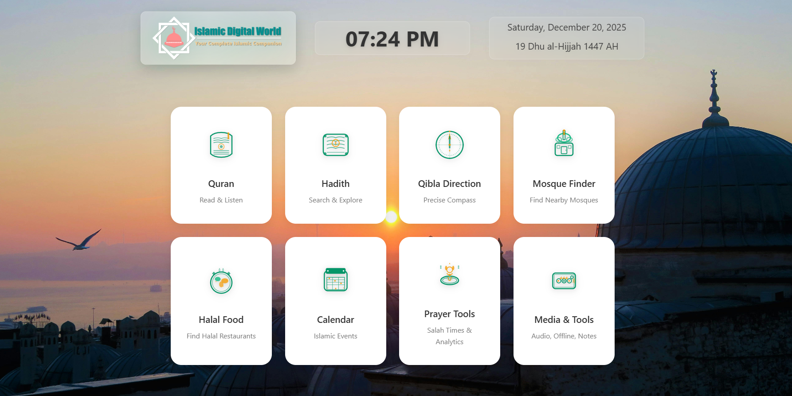

# Islamic Digital World

**Your Complete Islamic Companion** - A modern, feature-rich Progressive Web Application (PWA) for Muslims worldwide.



---

## Overview

Islamic Digital World is a comprehensive Islamic web application that provides essential tools and resources for practicing Muslims. Built with modern web technologies, it offers offline support, multi-language translations, and a beautiful user interface optimized for both desktop and mobile devices.

---

## Features

### Al-Quran Suite
- **Complete Quran** - All 114 Surahs with Arabic text
- **Audio Recitation** - Verse-by-verse audio playback with multiple reciters
- **11 Translations** - Arabic, English, Bengali, Urdu, Spanish, French, Indonesian, Russian, Turkish, Chinese, Hindi
- **Professional Audio Player** - Advanced controls with progress bar, shuffle, repeat
- **Tajweed Mode** - Enhanced reading with pronunciation rules
- **Bookmarking** - Save and organize favorite verses
- **Memorization Tracker** - Track your Quran memorization progress
- **Audio Visualizer** - Beautiful audio visualization during playback
- **Night Mode** - Comfortable reading in low light
- **Fullscreen Mode** - Distraction-free reading experience

### Hadith Library
- **6 Major Collections**:
  - Sahih Bukhari
  - Sahih Muslim
  - Sunan Abu Dawud
  - Jami' at-Tirmidhi
  - Sunan an-Nasa'i
  - Ibn Majah
- **Smart Search** - Search by number or keyword
- **Multi-language Translation** - Real-time translation support
- **Memory Caching** - Fast loading with intelligent caching

### Islamic Quiz Pro (NEW)
- **Dual Age Modes**:
  - **Adult Mode** - Professional UI with advanced questions
  - **Kids Mode** - Child-friendly design with fun animations
- **Server Sync** - Auto-fetch new questions from server
- **Multiple Game Modes**:
  - Quick Practice (5 questions)
  - Speed Round (timed)
  - Marathon (all questions)
  - Survival (3 lives)
  - Daily Brain Challenge (2x XP)
- **Gamification** - XP system, levels, streaks, achievements
- **10 Languages** - English, Arabic, Bengali, Hindi, Urdu, Indonesian, Turkish, French, Russian, Chinese
- **Categories** - Quran, Hadith, Seerah, Fiqh, Pillars, History, and more
- **Animations** - Confetti effects, bouncy cards, pulse animations
- **Leaderboard** - Track your progress and compete

### Prayer Tools
- **Accurate Prayer Times** - Based on your location
- **Next Prayer Countdown** - Real-time countdown
- **Prayer Reminders** - Customizable notifications
- **Prayer Logging** - Track daily prayers with streak counter
- **Multiple Calculation Methods** - Support for various madhabs

### Qibla Finder
- **Compass Navigation** - Accurate Qibla direction
- **Distance to Mecca** - Real-time distance calculation
- **Calibration Support** - Compass calibration for accuracy
- **Visual Indicators** - Green zone for correct alignment

### Mosque Finder
- **Interactive Map** - Find nearby mosques using OpenStreetMap
- **Radius Search** - Customizable search radius (1-50 km)
- **Mosque Details** - View address, distance, and directions
- **One-Click Navigation** - Get directions instantly

### Dua Collection
- **Categorized Duas** - Morning, Evening, Daily, Travel, etc.
- **Audio Playback** - Listen to dua recitations
- **Play/Pause/Stop Controls** - Full audio control
- **Arabic with Translation** - Complete transliteration

### Islamic Calendar
- **Hijri Calendar** - Complete Islamic calendar view
- **Islamic Events** - Important dates highlighted
- **Ramadan Tracker** - Track fasting days
- **Suhoor & Iftar Times** - Countdown timers

### Ramadan Mode
- **Fasting Timer** - Countdown to Suhoor/Iftar
- **Daily Tracking** - Log your fasts
- **Special Duas** - Ramadan-specific prayers

### 99 Names of Allah
- **Beautiful Display** - Arabic with meaning
- **Audio Pronunciation** - Learn correct pronunciation
- **Searchable** - Find specific names

### Tasbih Counter
- **Digital Counter** - Track your dhikr
- **Multiple Presets** - SubhanAllah, Alhamdulillah, etc.
- **Target Goals** - Set and track targets
- **Haptic Feedback** - Vibration on mobile

### Hajj & Umrah Guide
- **Step-by-Step Guide** - Complete pilgrimage instructions
- **Duas for Each Step** - With Arabic and translation
- **Preparation Checklist** - Track your preparations
- **Toggle between Hajj/Umrah** - Different rituals explained

### Halal Food Finder
- **Restaurant Search** - Find halal restaurants nearby
- **Cuisine Filters** - Filter by cuisine type
- **Map Integration** - Visual restaurant locations

### Media & Tools
- **Professional Audio Player** - Multiple reciter selection
- **Background Playback** - Listen while using other features
- **Sleep Timer** - Auto-stop playback
- **Notes & Bookmarks** - Personal annotations

### Customization
- **Theme Toggle** - Light and Dark modes
- **34+ Islamic Wallpapers** - Beautiful backgrounds
- **Wallpaper Rotation** - Auto-change intervals
- **Custom Wallpaper Upload** - Use your own images
- **Font Size Options** - Adjustable text sizes

---

## Mobile Version

A fully optimized mobile web app with:
- **Native App Feel** - Smooth animations and gestures
- **Bottom Navigation** - Easy thumb access
- **Swipe Gestures** - Natural navigation
- **Background Player** - Floating audio controls
- **Sleep Timer** - For night listening
- **All Features** - Complete feature parity with desktop

---

## Technical Specifications

### Technologies Used
- **HTML5** - Semantic markup
- **CSS3** - Modern styling with CSS variables, animations
- **JavaScript (ES6+)** - Vanilla JS, no framework dependencies
- **Leaflet.js** - Interactive maps
- **Phosphor Icons** - Beautiful icon set

### Data Sources
- **IslamicData API** - `https://islamicdata.netlify.app`
  - Quran Arabic text & translations
  - Verse-by-verse audio
  - Tajweed data
  - Complete Hadith collections
  - Quiz questions (Adult & Kids)

### Other APIs & Services
- **Aladhan API** - Prayer times calculation
- **OpenStreetMap/Overpass API** - Mosque and location data

### PWA Features
- **Service Worker** - Offline functionality
- **Web App Manifest** - Installable on devices
- **Responsive Design** - Works on all screen sizes
- **Touch Optimized** - Mobile-friendly interactions

---

## Installation

### Option 1: Direct Use
Simply open `index.html` in a modern web browser.

### Option 2: Local Server
```bash
# Using Python
python -m http.server 8000

# Using Node.js
npx serve .

# Using PHP
php -S localhost:8000
```

### Option 3: Deploy to Hosting
Upload all files to any static hosting service:
- Netlify
- Vercel
- GitHub Pages
- Firebase Hosting

---

## Browser Support

| Browser | Minimum Version |
|---------|-----------------|
| Chrome  | 80+ |
| Firefox | 75+ |
| Safari  | 13+ |
| Edge    | 80+ |
| Opera   | 67+ |

---

## Permissions Required

- **Location** - For prayer times, Qibla, and mosque finder
- **Device Orientation** - For Qibla compass
- **Notifications** - For prayer reminders (optional)
- **Storage** - For offline caching and preferences

---

## Configuration

### Theme Colors
```css
--primary: #10b981 (Emerald Green)
--primary-dark: #059669
--gold: #f59e0b
```

### API Configuration
Located in `js/app.js`:
```javascript
const CONFIG = {
    API_BASE: 'https://islamicdata.netlify.app/AlQuran',
    HADITH_BASE: 'https://islamicdata.netlify.app/Hadiths/JSON',
    QUIZ_ADULT: 'https://islamicdata.netlify.app/Quiz/islamic_quiz.json',
    QUIZ_KIDS: 'https://islamicdata.netlify.app/Quiz/islamic_quiz_children.json'
};
```

---

## Offline Capabilities

The app caches:
- All HTML, CSS, and JS files
- Font files and icon libraries
- Previously loaded Quran data
- Hadith collections (in memory)
- Quiz questions (localStorage)
- User preferences and progress

---

## Recent Updates

### Version 2.0 (December 2024)
- Added Islamic Quiz Pro with Adult & Kids modes
- Server-synced quiz questions with auto-update
- Gamification system (XP, levels, streaks)
- Enhanced animations and effects
- Improved translation UI with globe icon
- Added Dua audio player controls
- Mobile version with all features
- Professional audio player improvements
- Performance optimizations

---

## License

This project is open source and available under the MIT License.

---

## Credits

- **Quran & Hadith Data**: [IslamicData](https://islamicdata.netlify.app/)
- **Prayer Times**: [Aladhan API](https://aladhan.com/)
- **Maps**: [OpenStreetMap](https://www.openstreetmap.org/) & [Leaflet](https://leafletjs.com/)
- **Icons**: [Phosphor Icons](https://phosphoricons.com/)
- **Development**: Matrix Agent

---

## Support

For issues, suggestions, or contributions, please open an issue on the project repository.

---

**Developed with dedication for the Muslim Ummah**

*Bismillah - In the name of Allah, the Most Gracious, the Most Merciful*
