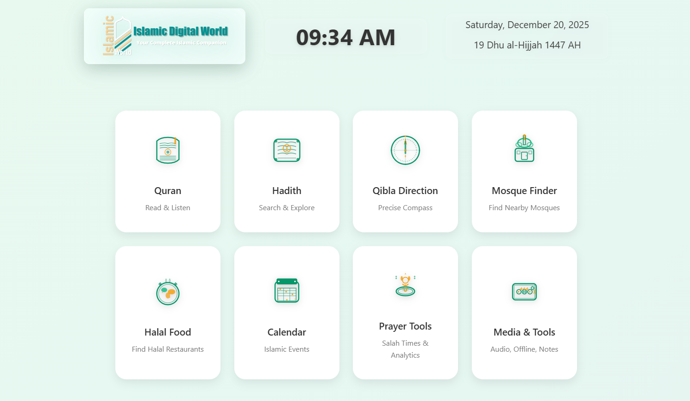

# Islamic Digital World

**Your Complete Islamic Companion** - A modern, feature-rich Progressive Web Application (PWA) for Muslims worldwide.



---

## Overview

Islamic Digital World is a comprehensive Islamic web application that provides essential tools and resources for practicing Muslims. Built with modern web technologies, it offers offline support, multi-language translations, and a beautiful user interface.

---

## Features

### Quran Suite
- **Complete Quran** - All 114 Surahs with Arabic text
- **Audio Recitation** - Multiple renowned reciters (Al-Afasy, Al-Husary, Maher Al-Muaiqly, Saad Al-Ghamdi, Shuraim)
- **Translations** - English, Bengali, Hindi, Urdu translations
- **Tajweed Mode** - Enhanced reading with pronunciation rules
- **Bookmarking** - Save and organize favorite verses
- **Memorization Tracker** - Track your Quran memorization progress
- **Audio Visualizer** - Beautiful audio visualization during playback
- **Night Mode** - Comfortable reading in low light
- **Fullscreen Mode** - Distraction-free reading experience

### Hadith Library
- **6 Major Collections**:
  - Sahih Bukhari (7,370 hadith)
  - Sahih Muslim (7,596 hadith)
  - Sunan Abu Dawud (5,260 hadith)
  - Jami' at-Tirmidhi (4,214 hadith)
  - Sunan an-Nasa'i (5,774 hadith)
  - Ibn Majah
- **Smart Search** - Search by number or keyword
- **Multi-language Translation** - Real-time translation to Bengali, Hindi, Urdu
- **Memory Caching** - Fast loading with intelligent caching

### Prayer Tools
- **Prayer Times** - Accurate prayer times based on location
- **Next Prayer Indicator** - Countdown to next prayer
- **Prayer Reminders** - Enable notifications for each prayer
- **Prayer Logging** - Track your daily prayers

### Qibla Finder
- **Compass Navigation** - Accurate Qibla direction
- **Distance to Mecca** - Real-time distance calculation
- **Calibration Support** - Compass calibration for accuracy
- **Visual Indicators** - Green zone for correct alignment

### Mosque Finder
- **Interactive Map** - Find nearby mosques using OpenStreetMap
- **Radius Search** - Customizable search radius (1-50 km)
- **Mosque Details** - View address, distance, and directions
- **Get Directions** - One-click navigation

### Islamic Calendar
- **Hijri Calendar** - Complete Islamic calendar
- **Islamic Events** - Important dates and occasions
- **Ramadan Tracker** - Track fasting days
- **Fasting Timer** - Suhoor and Iftar times

### Halal Food Finder
- **Restaurant Search** - Find halal restaurants nearby
- **Cuisine Filters** - Filter by cuisine type
- **Map Integration** - Visual restaurant locations

### Media & Tools
- **Quran Recitation Player** - Professional audio player
- **Azan Voices** - Multiple Azan options
- **Background Player** - Listen while using other features
- **Sleep Timer** - Auto-stop playback
- **Notes & Bookmarks** - Personal annotations

### Customization
- **Theme Toggle** - Light and Dark modes
- **34+ Islamic Wallpapers** - Beautiful background options
- **Custom Wallpaper Upload** - Use your own images
- **Font Size Options** - Adjustable text sizes
- **Language Support** - English, Bengali, Hindi, Urdu

---

### APIs & Services
- **Al-Quran Cloud API** - Quran text and audio
- **Aladhan API** - Prayer times calculation
- **OpenStreetMap/Overpass API** - Mosque and location data
- **Google Translate (via proxy)** - Real-time translations

### PWA Features
- **Service Worker** - Offline functionality
- **Web App Manifest** - Installable on devices
- **Responsive Design** - Works on all screen sizes
- **Touch Optimized** - Mobile-friendly interactions

---

## Installation

### Option 1: Direct Use
Simply open `index.html` in a modern web browser.

### Option 2: Local Server
```bash
# Using Python
python -m http.server 8000

# Using Node.js
npx serve .

# Using PHP
php -S localhost:8000
```

### Option 3: Deploy to Hosting
Upload all files to any static hosting service:
- Netlify
- Vercel
- GitHub Pages
- Firebase Hosting
- AWS S3

---

## Browser Support

| Browser | Minimum Version |
|---------|-----------------|
| Chrome | 80+ |
| Firefox | 75+ |
| Safari | 13+ |
| Edge | 80+ |
| Opera | 67+ |

---

## Permissions Required

- **Location** - For prayer times, Qibla, and mosque finder
- **Device Orientation** - For Qibla compass
- **Notifications** - For prayer reminders (optional)
- **Storage** - For offline caching and preferences

---

## Configuration

### Theme Colors
The app uses CSS variables for theming. Main colors:
```css
--primary: #10b981 (Emerald Green)
--primary-dark: #059669
--gold: #f59e0b
```

### API Configuration
Located in `js/app.js`:
```javascript
const CONFIG = {
    API_BASE: 'https://api.alquran.cloud/v1',
    STORAGE_KEY: 'islamic-guide-prefs',
    BOOKMARKS_KEY: 'islamic-guide-bookmarks'
};
```

---

## Performance

| Metric | Value |
|--------|-------|
| Total Size | ~500 KB (excluding images) |
| First Load | ~2-3 seconds |
| Cached Load | <1 second |
| Lighthouse Score | 90+ |

---

## Offline Capabilities

The app caches:
- All HTML, CSS, and JS files
- Font files
- Icon libraries
- Previously loaded Quran data
- Hadith collections (in memory)

---

## Known Limitations

1. **Translation API** - May have rate limits on heavy usage
2. **Mosque Data** - Depends on OpenStreetMap coverage
3. **Compass Accuracy** - Varies by device hardware
4. **Offline Hadith** - Requires initial online load for caching

---

## Contributing

Contributions are welcome! Please:
1. Fork the repository
2. Create a feature branch
3. Make your changes
4. Submit a pull request

---

## License

This project is open source and available under the MIT License.

---

## Credits

- **Quran Data**: [Al-Quran Cloud](https://alquran.cloud/)
- **Hadith Data**: [Fawaz Ahmed Hadith API](https://github.com/fawazahmed0/hadith-api)
- **Prayer Times**: [Aladhan API](https://aladhan.com/)
- **Maps**: [OpenStreetMap](https://www.openstreetmap.org/) & [Leaflet](https://leafletjs.com/)
- **Icons**: [Phosphor Icons](https://phosphoricons.com/)
- **Wallpapers**: [BugsFree CDN](https://bugsfreecdn.netlify.app/)

---

## Support

For issues, suggestions, or contributions, please open an issue on the repository.

---

**Developed with dedication for the Muslim Ummah**

*Bismillah - In the name of Allah, the Most Gracious, the Most Merciful*
